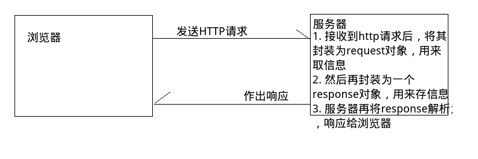

### 2018.07.10

# 一、servlet中的Request和Response
servlet是服务器中的一个类，Request和Response是使用servlet编写和控制的针对于浏览器端的程序。  
Response是向服务器发送回应，Request是浏览器向服务器发送请求。


# 二、使用response对象设置http响应协议中的信息
用来生成Http响应信息，发送给用户。

### 1、响应首行
```
HTTP/1.1 200 OK
```
- setStatus(int sc)：设置正常的响应状态码 status code
- setStatus(int sc， String sm)：设置正常的响应状态码,状态码描述 status message,过时，因为正常状态下，状态码信息不会显示给用户，所以没有必要设置
- sendError(int sc):设置错误的状态码
- sendError(int sc, String sm)：设置错误的状态码,包含错误信息
### 2、响应头
```
key:value
```
- setHeader(String name, String value):设置一个键值对，值为string
- setDateHeader(String name, long date)：设置一个键值对，值为long，long常用于毫秒的表示
- setIntHeader(String name, int value)：设置一个键值对，值为int类型
- setHeader(String name, String value):添加一个键值对，值为string
- setDateHeader(String name, long date)：添加一个键值对，值为long，long常用于毫秒的表示
- setIntHeader(String name, int value)：添加一个键值对，值为int类型
- add 和 set 区别在于，前置直接添加（key是可以重复的），后者会修改原来的，没有才会添加。

几个常见的响应头：

ContentType:text/html;charset=utf-8
Refresh:3;url=http://path 3秒后跳转网页  
html中meta标签的作用就是用于向响应头中添加信息。  
### 响应空行
```
一个分隔符
```
### 响应正文
```
需要发送的资源
```
 response.getWriter()：获取字符流
父类方法getOutputSteam()：获取输出字节流

# 三、实现请求重定向
### 1、手动实现：
实现重定向很简单，只需要两个步骤：

在响应头中添加302状态码，告诉浏览器需要进行重定向 
```
response.setStatus(302)
```
在响应头中添加Location，指定重定向的位置 
```
response.setHeader("Location", "http://www.baidu.com");
```
当用户请求servlet时，服务器返回一个类似上面的响应头，上面的信息告诉浏览器，应该重新进行一次请求，请求的地址为 Header中的Location地址。 
所以，请求重定向实际上是两次请求。

### 2、直接实现：
我们只需要使用:response.setRedirect("http://www.baidu.com")即可实现。

通过访问Servlet向浏览器传递一个图片
```
// 获取图片输入流
InputStream is = getServletContext().getResourceAsStream("/WEB-INFO/mm.jpg");
// 获取浏览器的输出流
byte[] buffer = new byte[1024];
// 将图片篇输入流写出到浏览器中
int len = -1;
while((len = is.readBuffer(buffer)) != -1){
    os.write(buffer, 0, len);
    os.flush();
}
```

# 四、通过访问Servlet下载文件
类似于图片，但是浏览器不能识别文件的名称和文件的类型，需要我们在响应头中设置文件的类型：
```
ServletContext sc = getServletContext();
String mimeType = sc.getMimeType("下载的文件名称"); // 传入下载的文件名称，会根据名称的拓展名识别mime类型
response.setContentType(type);
```

# 五、通过request对象获取http请求协议中的内容
用来生成http请求信息。

### 1、请求首行
```
请求方式 请求路径 协议/版本号
```
request.getMethod() 请求方式
request.getContextPath()，getServletPath()…获取请求路径
父类方法 request.getScheme() 获取请求协议

### 2、请求头
```
键值对
```

- request.getHeader(String name)
- request.getIntHeader(String name)
- request.getDateHeader(String name)
- request.getHeaderNames()
- request.getHeaders(Sring name)一个key对应多个value
### 3、请求空行

### 4、请求正文（post才有）
```
但是以下方法，无论是get还是post请求都可以获得参数值
```
- 父类方法 String getParameter(String name)
- Map<String, String[]> getParameterMap()
- Enumeration getParameterNames()
- String[] getParameterValues(String name)
# 六、解决响应和请求的乱码问题
### 1、处理get请求编码问题
解决方案:在conf/server.xml中URIEncoding="UTF-8" 69行，
```
<Connector URIEncoding="UTF-8" 
    connectionTimeout="20000" 
    port="8888" 
    protocol="HTTP/1.1" 
    redirectPort="8443"/>
```
设置URIEncoding为UTF-8

### 2、处理post请求编码问题
服务器响应时的数据，即服务器向浏览器传递的数据的编码格式由服务器决定： 
编码时使用的编码表，使用getByte("编码表")设置，或者使用response.setCharacterEncoding(编码表)设置。两者的区别在于 ，前者设置字节流码表，后者设置字符流码表。

解码时使用的编码表，使response.setHeader("ContentType","text/html;charset=utf-8")指定http响应头来设置。